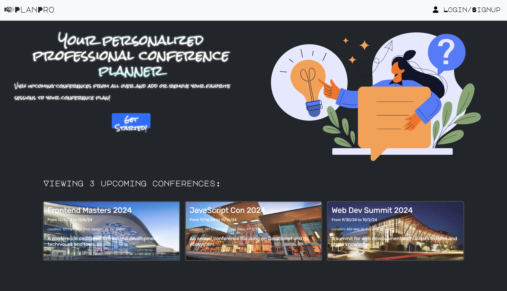
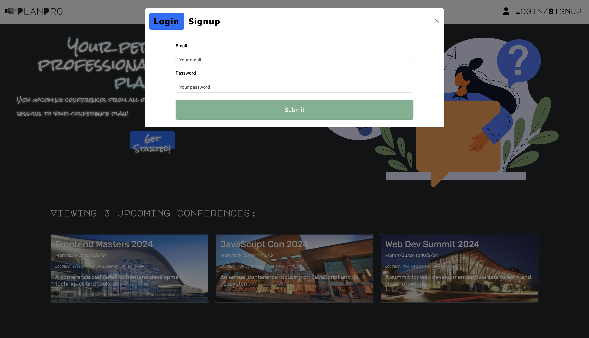
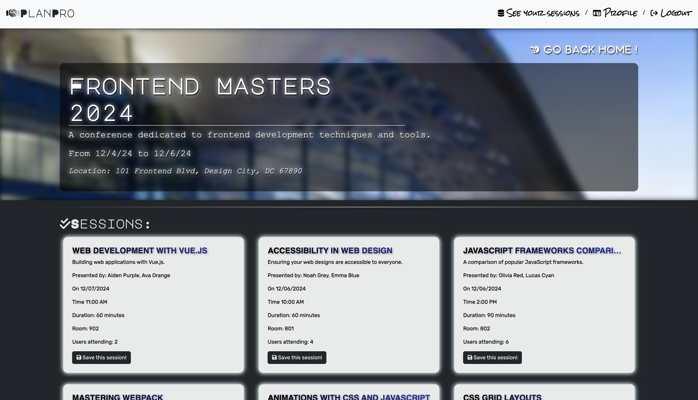
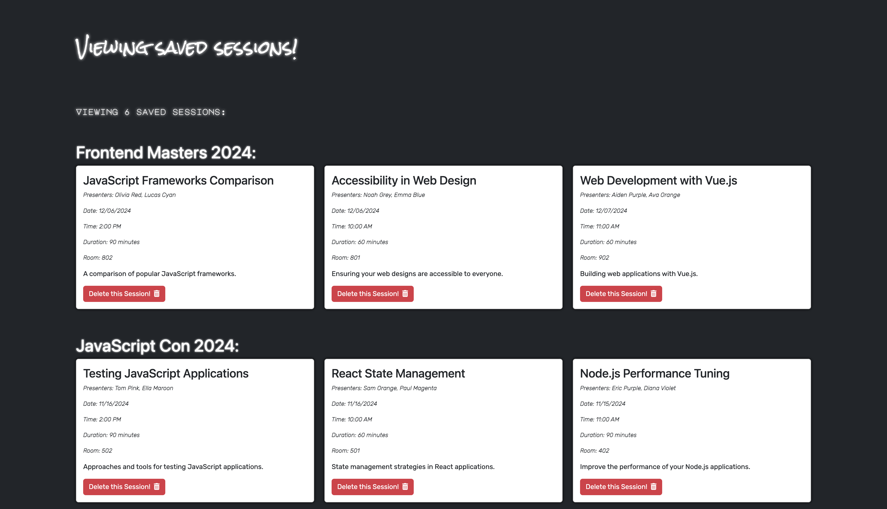
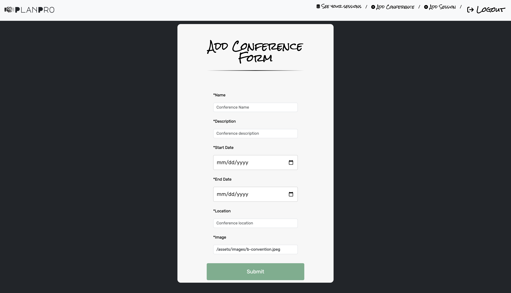
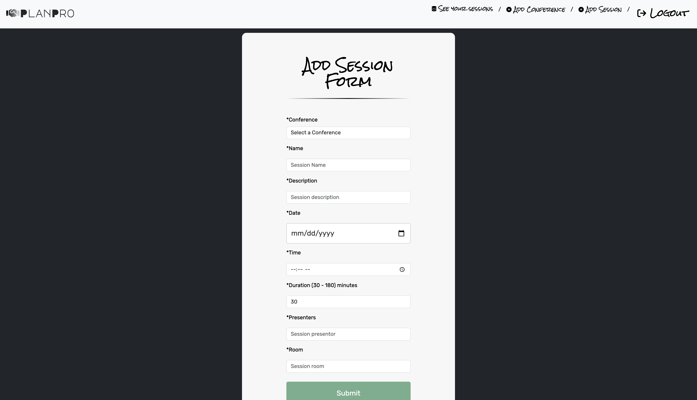

# PlanPro

## Table of Contents

1. [Description](#description)
2. [Installation](#installation)
3. [Usage](#usage)
4. [Technologies Used](#technologies-used)
5. [Features](#features)
6. [Screenshots](#screenshots)
7. [Live Link](#live-link)
8. [Credits](#credits)
9. [License](#license)

## Description

PlanPro is a web application that allows users to host and attend conferences and sessions. Users can create an account, browse available sessions, save the sessions they want to attend, and view their saved sessions to keep track of what they are attending.

## Installation

1.Clone the repository:
   
git clone [repository-url](https://github.com/mbarrie1979/PlanPro)

2.Navigate to the main directory:

    cd PlanPro

3.Install the dependencies:

    npm run install

4.Seed the database (optional):
    
     npm run seed

## Usage

1.To start the development server:

    npm run develop

2.To build the client:

    npm run build

3.To start the production server:

    npm start

## Technologies Used

- **Backend**:
  - Node.js
  - Express.js
  - MongoDB
  - Mongoose
  - GraphQL
  - Apollo Server
  - JWT Authentication

- **Frontend**:
  - React
  - React Router DOM
  - Apollo Client
  - Bootstrap
  - React Bootstrap

- **Utilities**:
  - bcrypt
  - dotenv
  - twilio
  - date-fns
  - jwt-decode

 ## Features

 - User registration and login with JWT authentication.
 - Create and manage conferences and sessions.
 - Save sessions to user profile.
 - View saved sessions with details.
 - Responsive design using Bootstrap.
 - Email reminders about upcoming sessions.
 - Indicates conflicts if sessions are at the same time.

## Screenshots

### Home Page

### Login/Signup

### Conference Page

### Saved Sessions Page

### Add Conference Form

### Add Session Form

## Live Link

Deployment Link [Click Here](https://planpro-9kzu.onrender.com/)

## Credits

#### Eric Lackram
#### Mark Barrie
#### Millind Joshi
#### Nardge Jean Fancois

## License

MIT standard license

